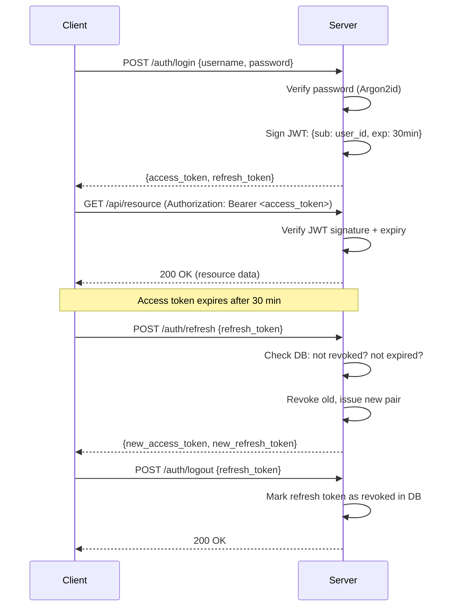

# Authentication

## Sessions (traditional approach)

When you log in, the server creates a **session** — a record stored server-side (in memory, Redis, or a database) that says "this user is authenticated." The server sends back a **session ID** as a cookie.

```
1. Client sends credentials
2. Server creates session record: { id: "abc123", user_id: 42, expires: ... }
3. Server sends cookie: session_id=abc123
4. Client sends cookie on every request
5. Server looks up "abc123" in its session store → finds user_id 42 → authenticated
```

**The server is the source of truth.** Every request requires a database/cache lookup to validate the session. If you want to revoke access, you delete the session record — instant.

**Downsides:** Server must store state for every active user. Doesn't scale easily across multiple servers (they all need access to the same session store). Cookies don't work well for mobile apps or third-party APIs.

## JWT tokens (stateless approach)

A JWT (JSON Web Token) is a **self-contained** token. Instead of storing session data on the server, the server encodes the data into the token itself and **signs** it cryptographically.

A JWT has 3 parts (base64-encoded, separated by dots):

```
eyJhbGciOiJIUzI1NiJ9.eyJzdWIiOiI0MiIsImV4cCI6MTcwOH0.signature
|---- header ----|  |--------- payload ---------|  |-- sig --|
```

- **Header**: algorithm used (HS256, RS256, etc.)
- **Payload**: the claims — `sub` (user ID), `exp` (expiry), and any other data
- **Signature**: `HMAC(header + payload, SECRET_KEY)` — proves the token wasn't tampered with



**No database lookup needed for access tokens.** The server just verifies the signature mathematically. This is why it's called "stateless."

**Downsides:** You **can't revoke** a JWT before it expires — the server has no record of it. If a token is stolen, it's valid until expiry. This is why access tokens are short-lived (30 min in our case).

## Two-token system: Access + Refresh

This is the trade-off that gives you the **best of both worlds**: stateless speed for normal requests (access token, no DB lookup), with the ability to revoke sessions (refresh token, stored in DB).

|               | Access Token                                | Refresh Token                           |
| ------------- | ------------------------------------------- | --------------------------------------- |
| **Format**    | JWT (signed, stateless)                     | JWT (stored in DB)                      |
| **Lifetime**  | ~30 minutes                                 | ~7 days                                 |
| **Sent with** | Every API request (`Authorization: Bearer`) | Only to `/auth/refresh`                 |
| **Revocable** | No (expires naturally)                      | Yes (marked as revoked in DB on logout) |

**Why two tokens?** A single long-lived token is dangerous if stolen (can't revoke a JWT). A single short-lived token forces constant re-login. The pair gives you short exposure + long sessions + revocability.

The flow:

```
1. Login → get access_token (30min) + refresh_token (7 days)
2. Use access_token for API calls
3. Access token expires → send refresh_token to POST /auth/refresh
4. Server checks refresh token in DB (not revoked? not expired?) → issues new access_token
5. Logout → server marks refresh_token as revoked in DB
```

## JWT payload (minimal by design)

```json
{ "sub": "user_id", "exp": 1234567890 }
```

Identity only. No permissions in the token — they live in the database so they can be changed/revoked instantly without reissuing tokens.

## Library choices

- **PyJWT** over python-jose — python-jose is abandoned (~3 years unmaintained). FastAPI docs switched to PyJWT in 2024.
- **pwdlib[argon2]** over passlib — passlib is unmaintained and breaks on Python 3.13+. pwdlib uses Argon2id (winner of the Password Hashing Competition).

## Auth flow in this project

```
POST /auth/register  → hash password, save user, assign default "viewer" role, return tokens
POST /auth/login     → verify password → return { access_token, refresh_token, user }
POST /auth/refresh   → verify refresh token → return new access_token
GET  /users/me       → decode JWT → return user profile + roles + permissions
POST /auth/logout    → revoke refresh token in DB
```

## How this project balances stateless vs stateful

```
JWT contains:  { sub: user_id, exp }          ← identity only, verified by signature
Database holds: RefreshTokens                  ← revocable, source of truth for sessions
Database holds: Users → Roles → Permissions    ← source of truth for authorization
```

Access tokens are verified mathematically (no DB hit). Permissions are checked by querying the DB on each request (so they can be changed instantly). Refresh tokens are in the DB so they can be revoked on logout.

## Frontend integration

- Store access token in memory, refresh token in httpOnly cookie
- On 401: silently call `/auth/refresh` for a new access token
- Use permissions from `/users/me` for UI rendering (show/hide elements)
- Never trust frontend permission checks — backend always re-validates
